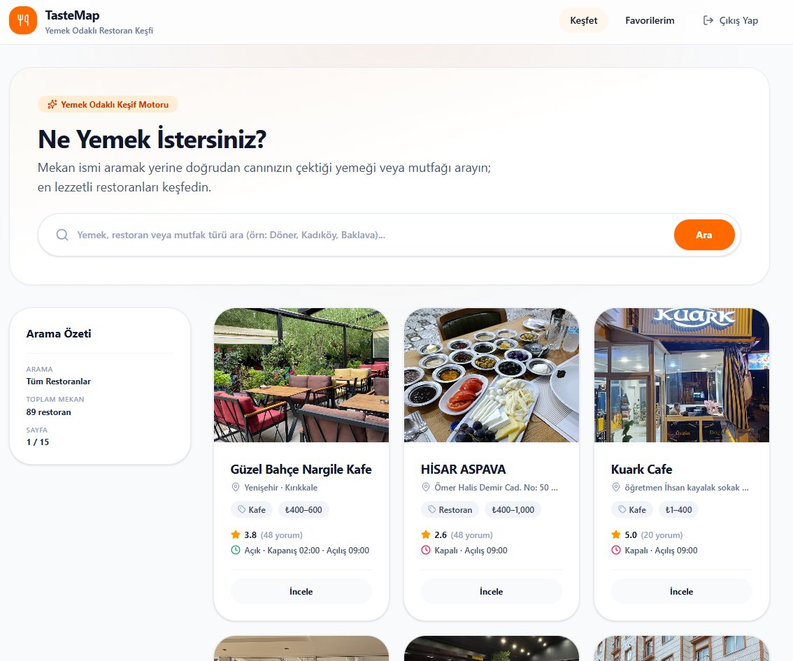
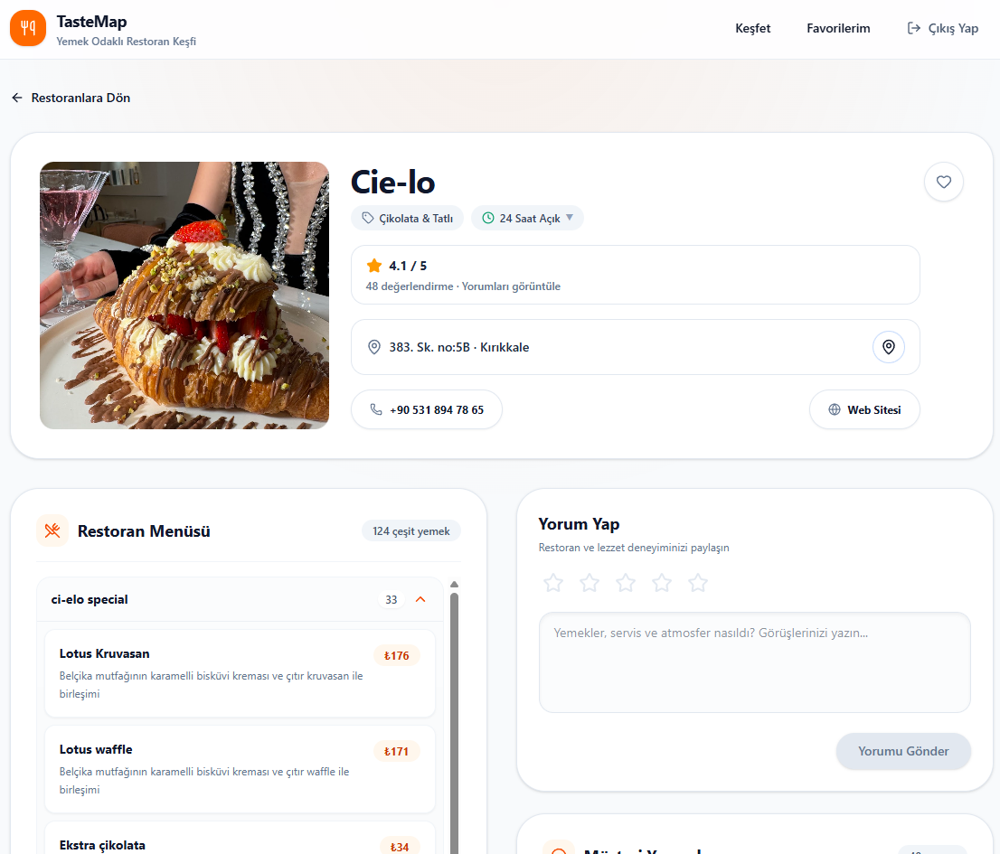
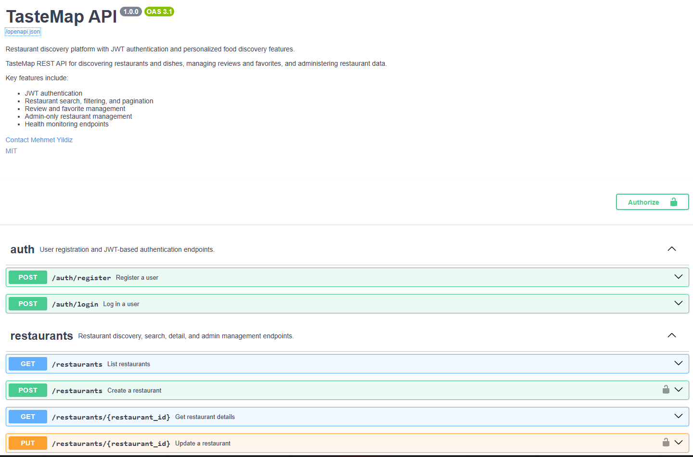

# TasteMap - Dish-Centric Restaurant Discovery Platform

[](https://tastemap.up.railway.app/)
[](https://tastemap-production-740b.up.railway.app/docs)

## Overview

TasteMap is a full-stack SaaS platform designed to shift restaurant discovery from venue names to dish-level exploration, allowing users to find specific food items, prices, and ratings directly.

The platform integrates an asynchronous FastAPI backend with a React (TypeScript) frontend and PostgreSQL database, backed by automated data extraction, normalization, and review synthesis pipelines.

The project emphasizes full-stack architectural integrity, character encoding resilience (Mojibake remediation), dynamic price normalization, and secure containerized deployment.

---

## Live Deployment

- **Frontend Web App:** [https://tastemap.up.railway.app/](https://tastemap.up.railway.app/)
- **Backend API & Swagger Documentation:** [https://tastemap-production-740b.up.railway.app/docs](https://tastemap-production-740b.up.railway.app/docs)

---

## Architecture

```text
React (TypeScript + Vite)
          │
          ▼
 FastAPI Backend (REST API)
          │
 ┌────────┴───────────────────┐
 ▼                            ▼
JWT Auth / Argon2      SQLAlchemy ORM
 │                            │
 ▼                            ▼
Security & Exception   Alembic Migrations
    Middleware                │
 │                            ▼
 └────────────┬───────────────┘
              ▼
    PostgreSQL Database
              ▲
              │
  Data Enrichment Pipeline
 (SerpAPI + Menu Extraction)


---

## Tech Stack

* Python (FastAPI, Pydantic)
* React (TypeScript, Vite, Tailwind CSS)
* PostgreSQL
* SQLAlchemy 2.0 & Alembic
* Docker & Docker Compose
* JWT (OAuth2 Password Flow) & Argon2
* SerpAPI (Google Maps / Reviews Integration)

---

## UI & API Showcase

### Restaurant Discovery & Dish Search


### Venue Details, Live Menu & Reviews


### Interactive API Documentation (Swagger)


---

## Project Workflow

### 1. Data Ingestion & Character Sanitization

* Extracted real-world restaurant metadata, menus, and customer reviews.
* Resolved severe CP437/UTF-8 Mojibake encoding artifacts across thousands of records.
* Implemented automated sanitization routines to maintain Turkish character fidelity in PostgreSQL.

### 2. Dish & Price Normalization

* Discarded flawed currency multiplier logic to prevent inflated pricing anomalies.
* Mapped menu items to realistic market standards and standardized categorization (beverages, desserts, mains, specials).
* Structured relational schemas linking items, categories, and venue references.

### 3. Backend & Security Architecture

* Built asynchronous CRUD routes for restaurants, menus, user reviews, and favorites.
* Enforced role-based access control (RBAC) and stateless JWT authentication with Argon2 password hashing.
* Implemented global exception handling to prevent database schema leakage in production.
* Configured dynamic CORS origin binding and environment variable isolation.

### 4. Frontend & User Experience

* Built responsive UI components with search, dynamic filtering, rating indicators, and interactive operating hours.
* Designed fallback states for venues without live digital menus to prevent application crashes.
* Managed API state and client-side caching using custom React hooks.

### 5. Containerization & Production Build

* Containerized services with multi-stage Docker builds and Docker Compose orchestration.
* Configured `.dockerignore` and `.gitignore` policies to isolate production images from local dumps, dependencies, and environment keys.
* Verified TypeScript compilation and asset bundling via Vite.

---

## Core Highlights

* **Dish-First Search:** Discover meals directly with accurate pricing instead of browsing generic venue lists.
* **Robust Data Pipeline:** Sanitized real-world review datasets and normalized unstructured digital menus.
* **Progressive Menu Coverage:** Currently includes fully enriched digital menus for launch venues; automated ingestion pipeline is expanding coverage for remaining locations progressively.
* **Production-Ready Security:** Hardened CORS, parameterized ORM queries against SQL injection, and zero-leak exception handling.

---

## Run Locally

### Prerequisites

* Docker and Docker Compose
* Node.js 18+ (for local frontend development)
* Python 3.11+ (for local backend development)

### Quickstart

1. Clone the repository:
```bash
git clone [https://github.com/yourusername/tastemap.git](https://github.com/yourusername/tastemap.git)
cd tastemap

```


2. Configure environment variables:
```bash
cp .env.example .env
cp frontend/.env.example frontend/.env

```


3. Launch services via Docker Compose:
```bash
docker compose up --build

```


4. Access the applications:
* **Frontend:** `http://localhost:5173`
* **API Documentation (Swagger):** `http://localhost:8000/docs`


---

## Learning Outcomes

* Full-Stack Web Architecture (FastAPI + React + PostgreSQL)
* Data Ingestion, Scraping, and Character Encoding Remediation
* Relational Database Modeling and Alembic Migration Management
* Stateless Authentication and Role-Based Authorization
* Container Orchestration and Secure Deployment Practices

```

```